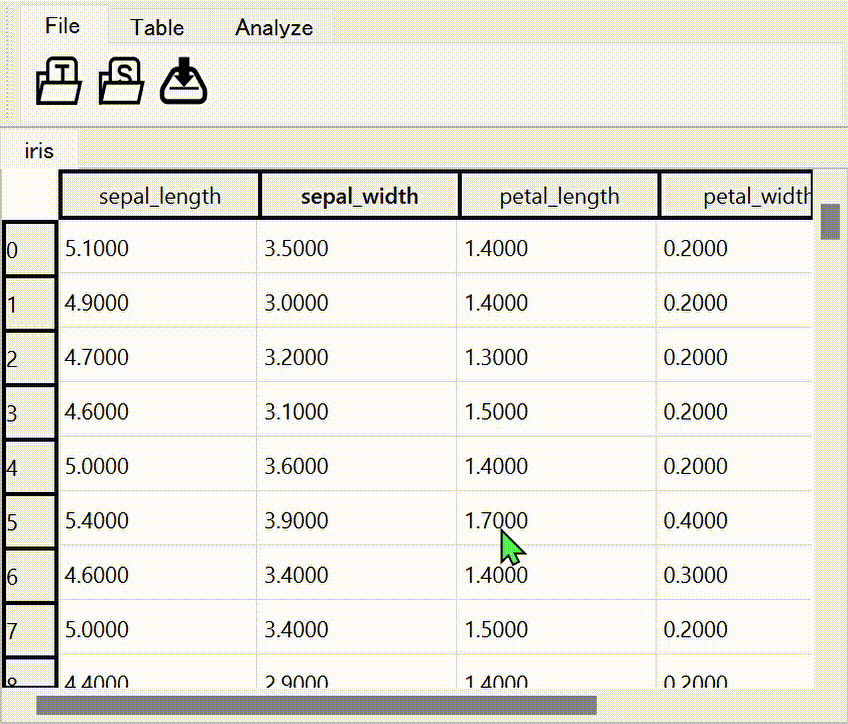
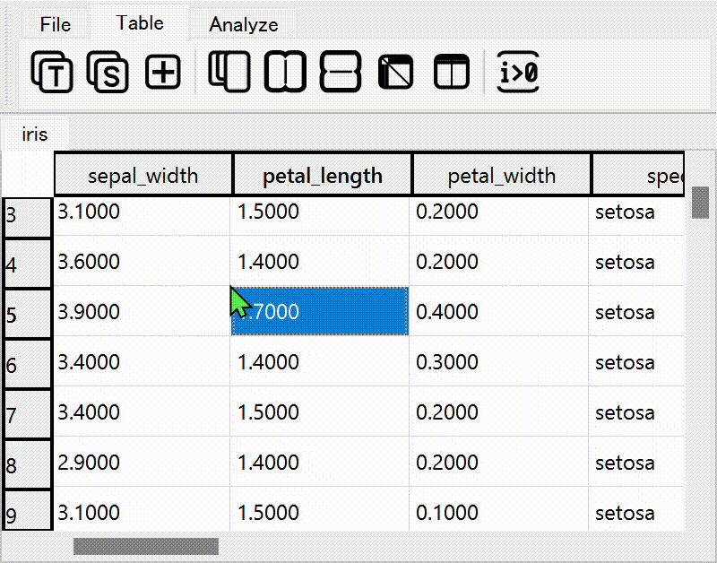
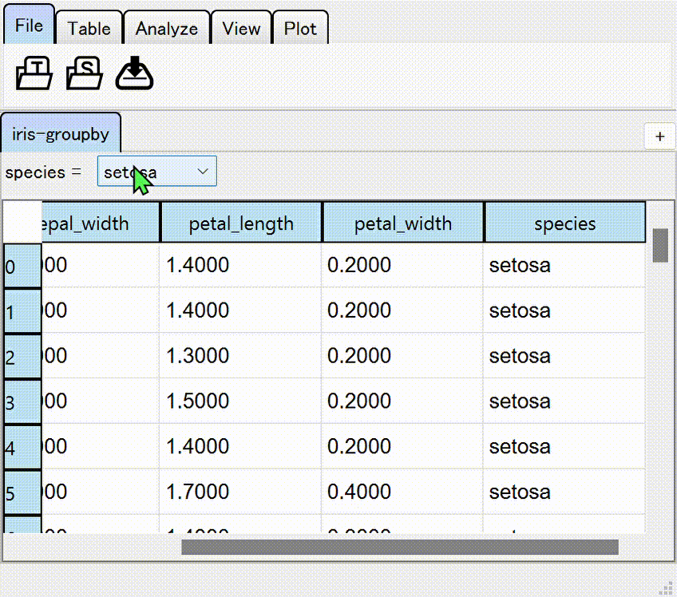

# tabulous

A table data viewer for Python.

```python
from tabulous import open_sample

viewer = open_sample("iris")
```


`tabulous` is highly inspired by [napari](https://github.com/napari/napari) in its design and API.

```python
df = pd.read_csv("data.csv")
viewer.add_table(df)  # add table data to viewer
viewer.tables  # table list
table = viewer.tables[1]  # get table
table.data  # get pd.DataFrame object (or other similar one)

# Connect data changed signal
# See https://github.com/hanjinliu/tabulous/blob/main/examples/04_data_changed_signal.py
@table.events.data.connect
def _on_data_change(info):
    """data-changed callback"""

# Connect selection changed signal
# See https://github.com/hanjinliu/tabulous/blob/main/examples/05_selection_changed.py
@table.events.selections.connect
def _on_selection_change(selections):
    """selection-changed callback"""

```

### Supported table types

|**Table**|**SpreadSheet**|**Groupby**|
|:-:|:-:|:-:|
||||
|A dtype-tagged table view with fixed size, aimed at viewing and editing `pd.DataFrame`.|A string based table editor. Table is converted into `pd.DataFrame` object with proper dtypes consistent with reading CSV file using `pd.read_csv`.|A table group that corresponds to the returned object of the `groupby` method of `pd.DataFrame`.|
