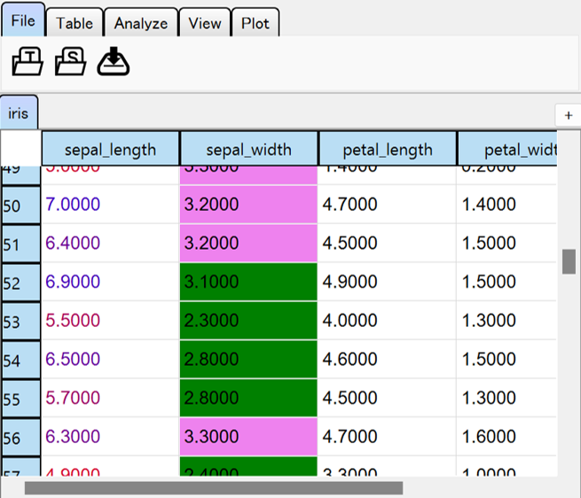
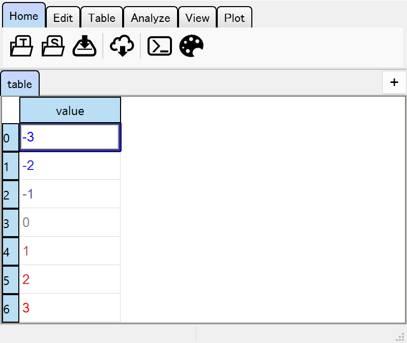
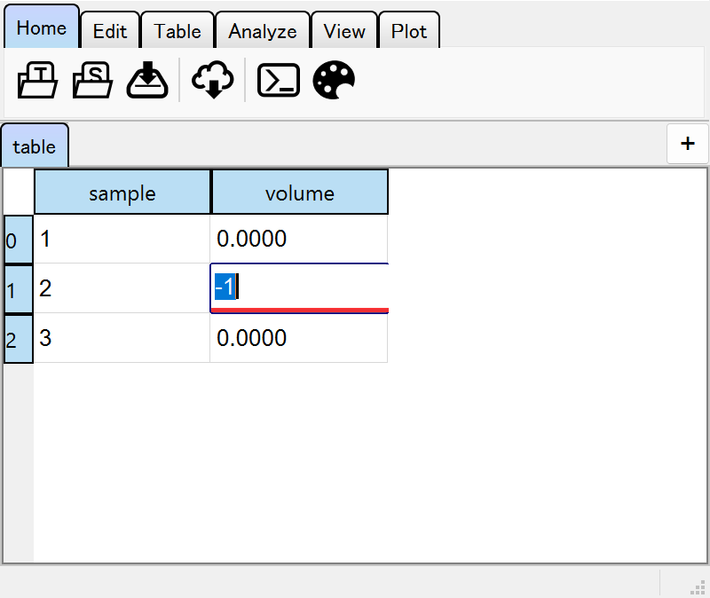
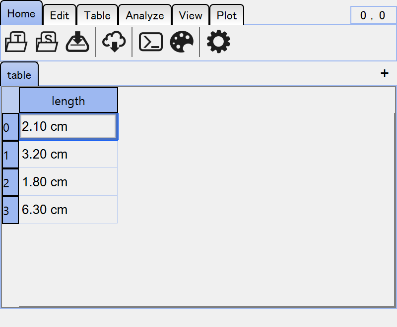

====================
Column-wise Settings
====================

Tables are composed of several columns with different data types. There are some settings
that can be applied to each column individually, for better visualizing the data and safely
editing the data.

.. contents:: Contents
    :local:
    :depth: 2

Each column-specific setting is stored as a ``dict`` like field.

Colormap
========

A "colormap" is a function that maps a value to a color. All the colormaps are stored in
:attr:`text_color` / :attr:`background_color` fields.

Use Colormap Functions
----------------------

The text color and the background color can be set for each column.
You can provide a custom colormap function to do this by :meth:`set` method of fields.
A colormap function must return a RGBA array (0-255) or a standard color name.

.. code-block:: python

    viewer = TableViewer()
    table = viewer.open_sample("iris")

    lmin = table.data["sepal_length"].min()
    lmax = table.data["sepal_length"].max()
    lrange = lmax - lmin

    # set a continuous colormap to the "sepal_length" column
    @table.text_color.set("sepal_length")
    def _(x: float):
        red = np.array([255, 0, 0, 255], dtype=np.uint8)
        blue = np.array([0, 0, 255, 255], dtype=np.uint8)
        return (x - lmin) / lrange * blue + (lmax - x) / lrange * red

.. code-block:: python

    # set a discrete colormap to the "sepal_width" column
    @table.background_color.set("sepal_width")
    def _(x: float):
        return "green" if x < 3.2 else "violet"

Since the fields are ``dict`` like, you can refer to existing colormaps or set new ones.

.. code-block:: python

    print(table.text_color["sepal_length"])  # get the colormap function
    table.text_color["sepal_length"] = new_cmap  # set a new colormap
    del table.text_color["sepal_length"]  # reset the existing colormap

Use Dictionaries
----------------

For categorical data, you can also use dictionaries to set the colors.

.. code-block:: python

    cmap = {
        "setosa": "red",
        "versicolor": "green",
        "virginica": "blue",
    }
    # set discrete colormap
    table.text_color.set("species", cmap)
    # or like this
    table.text_color["species"] = cmap

Use :mod:`matplotlib` Colormaps
-------------------------------

The colormap names defined in :mod:`matplotlib` are available. Limits of the contrast
will be defined by the mininum/maximum values of the column.

.. code-block:: python

    table.text_color["sepal_length"] = "inferno"

.. note::

    Since colormaps are defined continuously, data type of the column must be numbers,
    datetime or timedelta.

Interpolate Colors to Define Colormaps
--------------------------------------

In many cases, you'll want to define your own colormap by supplying colors that
represent the minimum/maximum values, or several colors with their corresponding
values.

The ``interp_from`` argument is useful for this purpose. A linearly segmented
colormap will be defined .

.. code-block:: python

    viewer = TableViewer()
    table = viewer.add_table({"value": [-3, -2, -1, 0, 1, 2, 3]})

    # use value -> color mapping
    table.text_color.set("value", interp_from={-3: "blue", 0: "gray", 3: "red"})

    # or a list of (value, color)
    table.text_color.set("value", interp_from=[(-3, "blue"), (0, "gray"), (3, "red")])

.. note::

    You can just pass a list of colors to define a equally divided colormap.

    .. code-block:: python

        table.text_color.set("value", interp_from=["blue", "gray", "red"])

    The simplest argument will be two colors, which represent minimum/maximum.

    .. code-block:: python

        table.text_color.set("value", interp_from=["blue", "red"])

Set Colormaps in GUI
--------------------

Some basic colormaps are available in the right-click context menu of the columns,
such as ``Color > Set background colormap``.

Validator
=========

Simple data type conversion is sometimes not enough. To make editing data safer, you can
customize the validator for each column.

Set validator Functions
-----------------------

A validator function doesn't care about the returned value. It should raise an exception
if the input value is invalid. In following example, negative value is interpreted as
invalid and the editor becomes red.

.. code-block:: python

    viewer = TableViewer()
    table = viewer.add_table(
        {"sample": [1, 2, 3], "volume": [0., 0., 0.]},
        editable=True,
    )

    @table.validator.set("volume")
    def _(x: float):
        if x < 0:
            raise ValueError("Volume must be positive.")

.. note::

    A :class:`Table` object converts the input value to the data type of the column.
    The validator function is called *after* the conversion.

.. note::

    Unlike other column setting, validators can NOT be set from GUI. This is because
    changing data validation rule might break the safety of the table data.

Text Formatter
==============

Text formatters are used to convert the values to strings without changing the data
itself. This is useful for displaying data in a more readable format.

.. note::

    Text formatters are called every time cells are painted. Formatters should not
    take too much time to run.

Set formatter function
----------------------

As usual in this chapter, you can use functions that convert a value into a string
as formatter function.

- The formatted strings do not affect the real data.
- The formatted strings are not necessary to satisfy the column specific validation
  including data type conversion.

.. code-block:: python

    viewer = TableViewer()
    table = viewer.add_table({"length": [2.1, 3.2, 1.8, 6.3]})

    @table.formatter.set("length")
    def _(x: float):
        return f"{x:.2f} cm"

Set formatter string
--------------------

Instead of passing a function, you can also use a ready-to-be-formatted strings.

.. code-block:: python

    table.formatter.set("sepal_length", "{:.2f} cm")

    # or use __setitem__
    table.formatter["sepal_length"] = "{:.2f} cm"

Example above is identical to passing ``"{:.2f} cm".format``.

Set Formatter in GUI
--------------------

Some basic formatters are available in the right-click context menu of the columns,
such as ``Formatter > Set text formatter``. You'll see a preview of the column in
the dialog.

Typing Spreadsheet
==================

In a spreadsheet, data types are determined for each column based on its content
because a spreadsheet is a string-based table data in general. This characteristic
raises a problem of data type. This drawback is especially important when you want
to use data types such as ``datetime64`` or ``category``.

To solve this problem, ``SpreadSheet`` implements a typing system on each column.
You can tag any data types supported by ``pandas`` to each column, and optionally
set validator functions appropriate for the data types.

.. code-block:: python

    viewer = TableViewer()
    sheet = viewer.add_spreadsheet({"int": [1, 2, 3], "label": ["a", "b", "c"]})

    # set dtypes
    sheet.dtypes["int"] = "int64"
    sheet.dtypes["label"] = "category"

    # since "dtypes" is a dict-like field, you can also use "update"
    sheet.dtypes.update(int="int64", label="category")

    # set dtypes and default validators
    sheet.dtypes.set("int", "int64")
    sheet.dtypes.set("label", "category")

.. code-block:: python

    sheet.data.dtypes

.. code-block::

    int    int64
    label  category
    dtype: object

You can also set dtypes from GUI. Right-click the column header and select
``Column dtype``.
