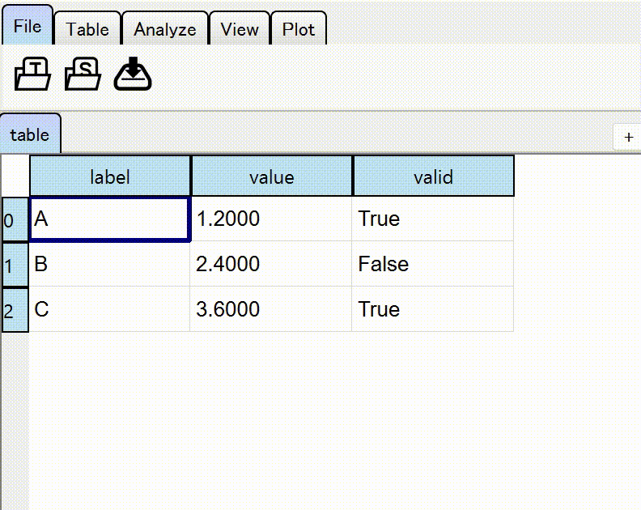

==============
User Interface
==============

.. contents:: Contents
    :local:
    :depth: 2

Tables
======

Move around the table
---------------------

Arrow keys ``→``, ``←``, ``↑``, ``↓`` with ``Ctrl`` (or ``⌘`` in Mac), ``Shift`` modifier
work as you expects in most of table data editors.

Additionally, ``Ctrl`` + ``mouse wheel`` zooms in/out the table. ``Ctrl`` + ``Alt`` + arrow
keys scrolls the table to the desired direction.

.. image:: ../fig/table_interface_0.gif

Edit cells and headers
----------------------

If a table is editable, you can edit the values of cells and headers. Double-clicking, ``F2``
or typing any characters will create an editor for the value.

During editing, the text will always be validated. Invalid text will be shown in red. For the
table cells, you can set any validation rules (see :doc:`/main/columnwise_settings`). For
the table headers, duplicated names are not allowed and considered to be invalid.

Excel-style data evaluation
---------------------------

Simple analysis should be done inside the table cells, especially when you are using
SpreadSheet. In Excel and Google Spreadsheet, you can do it by typing, say, ``=SUM(A1:A4)``,
to calculate the sum of the values in the range ``A1:A4``.

In :mod:`tabulous`, string starts with ``=`` will be evaluated as a Python literal. Current table
data is available as a variable ``df``. By default, modules :mod:`numpy` and :mod:`pandas` are
also available as ``np`` and ``pd``. If the input string starts with ``=``, the editor is
automatically switched to the literal evaluation mode and cell selection will insert table data
reference to the editor. For instance, if you select column ``'A'`` and rows from 1 to 8, then
``df['A'][1:9]`` will be inserted.

One of the differences between :mod:`tabulous` and Excel is that :mod:`tabulous` does not use
reference, so that changing the value of any of the source cells will **NOT** affect the value
of the destinations.

.. note::

  If you want to edit a cell to a string starts with "=", such as `"=a"`, then you can type
  ``="=a"``.

Scalar value
^^^^^^^^^^^^

If the evaluation result is a scalar value,

+---+------+--------------------------+
|   | col-0|                     col-1|
+---+------+--------------------------+
| 0 |   10 | =np.sum(df['col-0'][0:3])|
+---+------+--------------------------+
| 1 |   20 |                          |
+---+------+--------------------------+
| 2 |   30 |                          |
+---+------+--------------------------+

it will simply update the current cell.

+---+------+------+
|   | col-0| col-1|
+---+------+------+
| 0 |   10 |   60 |
+---+------+------+
| 1 |   20 |      |
+---+------+------+
| 2 |   30 |      |
+---+------+------+

Column vector
^^^^^^^^^^^^^

If the evaluation result is an array such as ``pd.Series``,

+---+------+-----------------------------+
|   | col-0|                        col-1|
+---+------+-----------------------------+
| 0 |   10 | =np.cumsum(df['col-0'][0:3])|
+---+------+-----------------------------+
| 1 |   20 |                             |
+---+------+-----------------------------+
| 2 |   30 |                             |
+---+------+-----------------------------+

it will update the relevant cells.

+---+------+------+
|   | col-0| col-1|
+---+------+------+
| 0 |   10 |   10 |
+---+------+------+
| 1 |   20 |   30 |
+---+------+------+
| 2 |   30 |   60 |
+---+------+------+

You don't have to edit the top cell. As long as the editing cell will be one of the
destinations, result will be the same.

+---+------+-----------------------------+
|   | col-0|                        col-1|
+---+------+-----------------------------+
| 0 |   10 |                             |
+---+------+-----------------------------+
| 1 |   20 | =np.cumsum(df['col-0'][0:3])|
+---+------+-----------------------------+
| 2 |   30 |                             |
+---+------+-----------------------------+

Row vector
^^^^^^^^^^

An row will be updated if the result should be interpreted as a row vector.

+---+------+----------------------------------------+
|   | col-0| col-1                                  |
+---+------+----------------------------------------+
| 0 |   10 |    20                                  |
+---+------+----------------------------------------+
| 1 |   20 |    40                                  |
+---+------+----------------------------------------+
| 2 |   30 |    60                                  |
+---+------+----------------------------------------+
| 3 |      | =np.mean(df.loc[0:3, 'col-0':'col-1']) |
+---+------+----------------------------------------+

will return ``pd.Series([20, 40])``, which will update the table to

+---+------+------+
|   | col-0| col-1|
+---+------+------+
| 0 |   10 |   20 |
+---+------+------+
| 1 |   20 |   40 |
+---+------+------+
| 2 |   30 |   60 |
+---+------+------+
| 3 |   20 |   40 |
+---+------+------+

Send the values to the console
------------------------------

``Ctrl + I`` in the console will insert a data reference object ``DATA[...]`` at the cursor
position. The data reference object is updated in real-time when the table selection is
changed. This is the fastest way to obtain the values in the table.

Toolbar
=======

Toolbar contains many functions that help you with analyzing the table data.

.. note::

    You can "click" any buttons in the toolbar using the keyboard; push ``Alt`` (or ``⌥``
    in Mac)  to change focus to the toolbar, and follow the tooltip labels to find the
    appropriate key combo to get to the button you want (similar to Microsoft Office).

File menu
---------

.. |open_spreadsheet| image:: ../../tabulous/_qt/_icons/open_spreadsheet.svg
  :width: 20em

- |open_table| ... Open a table data as a :class:`Table` from a file using a
  file dialog.
- |open_spreadsheet| ... Open a table data as a :class:`SpreadSheet` from a
  file using a file dialog.
- |save_table| ... Save the currently active table data using a file dialog.
- |open_sample| ... Open a sample data from ``seaborn``.

Table menu
----------

.. |switch_header| image:: ../../tabulous/_qt/_icons/switch_header.svg
  :width: 20em

- |copy_as_table| ... Make a copy of the active table as a :class:`Table`.
- |copy_as_spreadsheet| ... Make a copy of the active table as a :class:`SpreadSheet`.
- |groupby| ... Call :meth:`pd.groupby` on the active table.
- |switch_header| ... Switch the column header and the first row.
- |concat| ... Call :meth:`pd.concat` on the active table.
- |pivot| ... Call :meth:`pd.pivot` on the active table.
- |melt| ... Call :meth:`pd.melt` on the active table.
- |find_item| ... Open the finder widget. Several item matching mode (match by text,
  match by value, partial match and regular expression) are available.
- |sort_table| ... Sort table by a column.

Analyze menu
------------

- |summarize_table| ... Summarize table data by mean, standard deviation etc.
- |eval| ... Evaluate a string expression on the table data. Essentially equivalent
  to call :meth:`pd.eval`.
- |filter| ... Filter table data by a string expression.
- |toggle_console| ... Toggle the console widget visibility.

View menu
---------

- |view_popup| ... Popup current active table.
- |view_dual_h| ... Activate dual view mode (horizontal).
- |view_dual_v| ... Activate dual view mode (vertical).
- |view_reset| ... Reset view mode.

Plot menu
---------

.. |plot| image:: ../../tabulous/_qt/_icons/plot.svg
  :width: 20em

- |plot| ... Plot table data by :meth:`plt.plot`.
- |scatter| ... Plot table data by :meth:`plt.scatter`.
- |hist| ... Plot histogram of the data by :meth:`plt.hist`.
- |new_figure| ... Create a new figure on the side area.

The embedded plot canvas is interactive.
You can also double click the objects in plot canvas to edit its color, line width, etc.

.. warning::

    The matplotlib editor is WIP now. Its behavior may change in the future.
